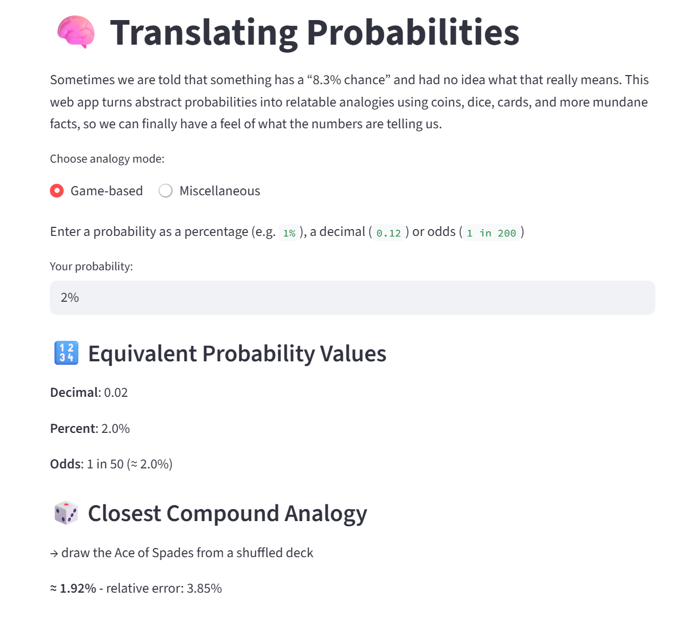

# Probability Translator

This is a small web app built with **Streamlit** that helps users understand what abstract probabilities actually *mean*. By translating probabilities into relatable real-world analogies using **dice**, **cards**, **coins**, **birth stats**, and other human-scale references, it makes numbers like “0.2% chance” feel concrete.

## 🚀 Features

- Input any probability (e.g., `3.5%` or `1 in 287`)
- See it translated into:
  - Decimal, percent, and odds form
  - A relatable analogy
  - The closest compound random event (e.g., “flip 5 coins and get all heads”)

## 🧩 Modes

- **Game-based**: analogies using dice, cards, coins, poker hands, etc.
- **Miscellaneous**: analogies using biological, social, and everyday probabilities.

